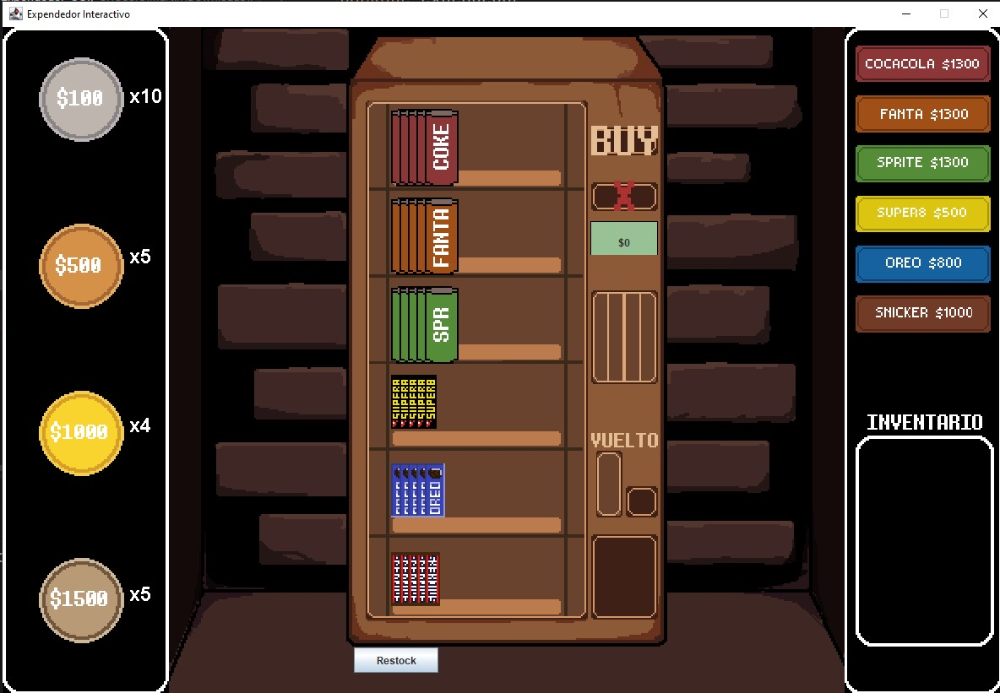
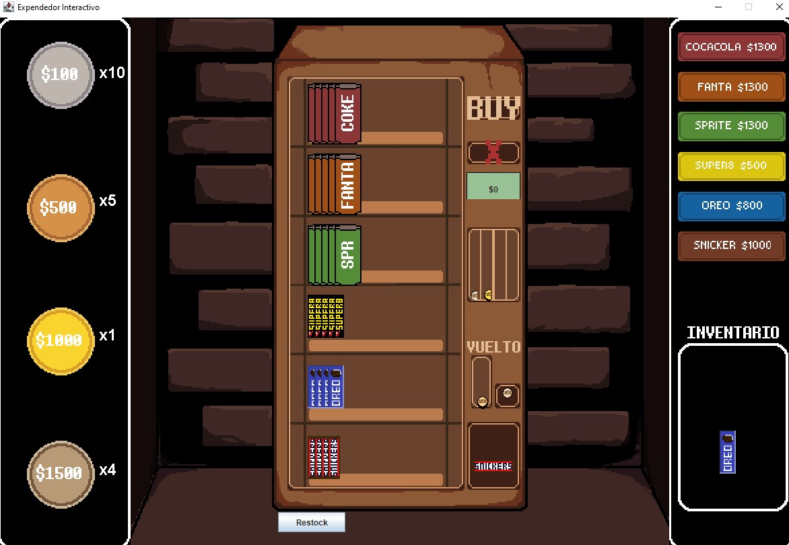
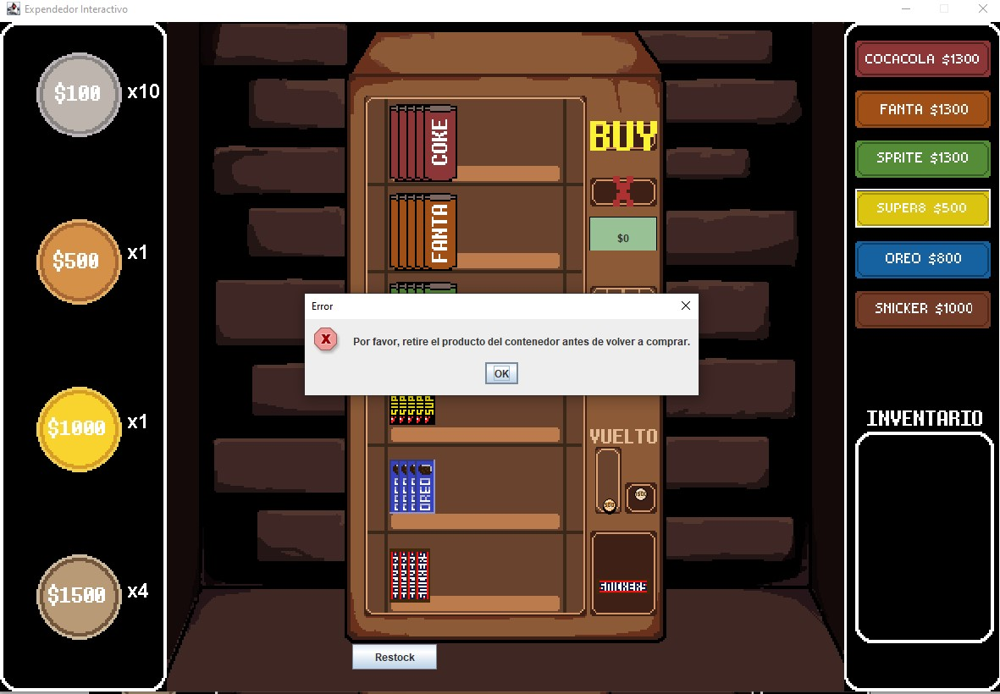
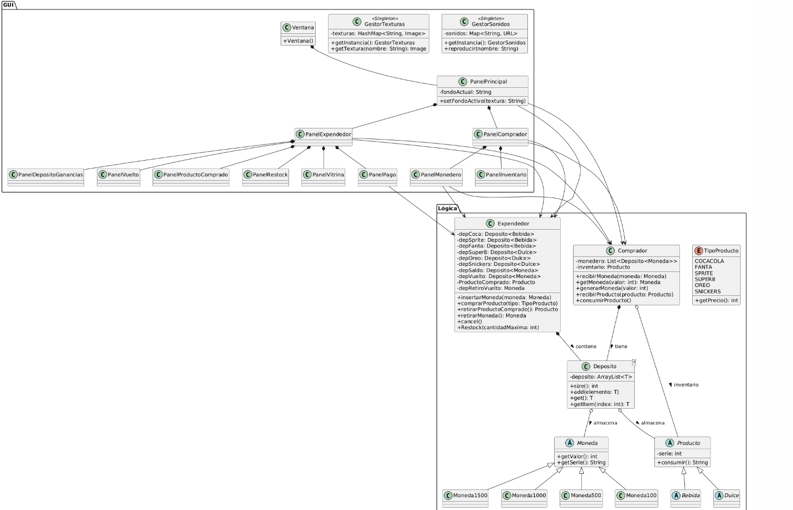

# Proyecto-Expendedor-GUI
Tarea 3 - Desarrollo Orientado a Objetos - Ingeniería Civil Informática

Desarrolladores: Martin Ignacio Bastias Neira, Daniel Esteban Ortiz Estrada y Benjamin Alonso Silva Sepúlveda.

